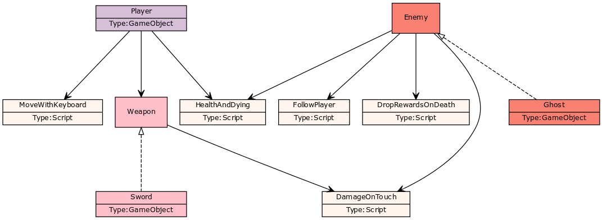
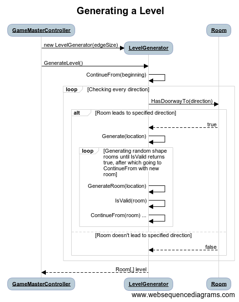

# Arkkitehtuuri

## Luokkakaavio

Unity-kehitys ei lähtökohtaisesti ole _oliopohjaista_, vaan _komponenttipohjaista_.
Tämä 'luokkakaavio' ei siis kuvaa luokkia, vaan _GameObjecteja_, Unityn keskeisiä rakennuspalikoita, ja niihin liittyvää koodia komponenttien eli _Scriptien_ muodossa.
Perintänä on kuvattu Unityn _Tag_-systeemi: Ghost-vihollisella on tagi Enemy, jonka ansiosta tunnistetaan, että kyseessä on vihollinen.
Ei siis ole Enemy-luokkaa, eikä Enemy itse ole mikään, jolla olisi komponentteja, vaan kaaviossa on kuvattu, että kaikilla GameObjecteilla, joilla on Enemy-tag, on komponenttina tietyt Scriptit.

Lisäys 24.4. Testattavuuden vuoksi minun piti muuttaa lähestymistapaani: Nykyinen sovellus noudattaa pääpiirteittäin samaa rakennetta, mutta komponentit eivät enää olekaan Unitylle tyypillisimpiä MonoDevelop-scriptejä, vaan helposti testattavissa olevia apuluokkia, jotka eivät tiedä omistajastaan (eli GameObjectistaan) mitään muuta kuin mahdollisen rajapinnan tarjoamat tiedot.
Nyt ne siis vastaavatkin perinteisiä olio-ohjelmoinnin luokkia.
Päivitän tämän kaavion kuvaamaan myös tasogeneraatiota pian.

## Sekvenssikaavio

Kaavio kuvaa tasojen satunnaisgenerointia.
GameMasterController on MonoDevelop-scripti, eli se hoitaa työn UI-puolen, ja LevelGenerator on vastuussa koko logiikasta.

