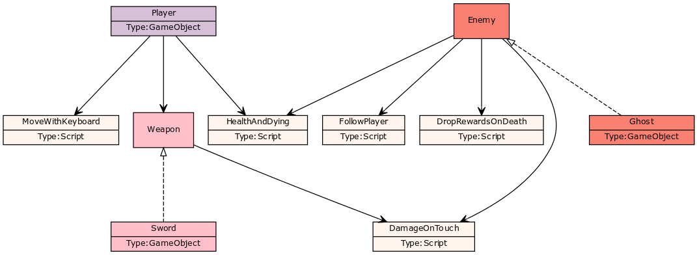

# Arkkitehtuuri

Unity-kehitys ei lähtökohtaisesti ole _oliopohjaista_, vaan _komponenttipohjaista_.
Tämä 'luokkakaavio' ei siis kuvaa luokkia, vaan _GameObjecteja_, Unityn keskeisiä rakennuspalikoita, ja niihin liittyvää koodia komponenttien eli _Scriptien_ muodossa.
Perintänä on kuvattu Unityn _Tag_-systeemi: Ghost-vihollisella on tagi Enemy, jonka ansiosta tunnistetaan, että kyseessä on vihollinen.
Ei siis ole Enemy-luokkaa, eikä Enemy itse ole mikään, jolla olisi komponentteja, vaan kaaviossa on kuvattu, että kaikilla GameObjecteilla, joilla on Enemy-tag, on komponenttina tietyt Scriptit.

)
