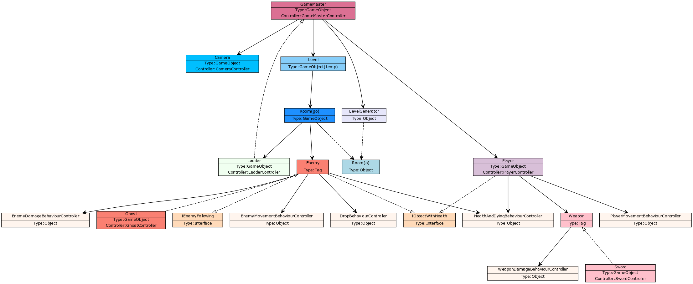

# Arkkitehtuuri

## Arkkitehtuurikuvaus

Sovellus koostuu kolmesta eri tasosta:
Korkean tason **GameObject**-olioista, joita luodaan ja käsitellään Unityn sisällä,
**MonoDevelop**-skripteistä, eli luokista jotka kontrolloivat GameObjecteja suoraan,
ja perinteisistä **luokista**, jotka suorittavat sovelluslogiikkaa.

Tämä rakenne on helposti testattava:
Koska GameObjectit ja niitä ohjaavat MonoDevelop-skriptit hoitavat UI-puolen ja näin kaikki riippuvuuksia vaativat toimet, sovelluslogiikkaa käsitteleville luokille on helppo kirjoittaa kattavat yksikkötestit.
Käytössä on lisäksi **rajapintoja**:
Kun on tärkeää, että logiikkaa käsittelevä luokka pääsee ohjaamaan jotain osaa GameObjectin käyttäytymisestä, sen GameObjektin MonoDevelop-kontrollerin tulee implementoida jokin luomani rajapinta, ja näin logiikkaluokka on riippuvainen vain rajapinnasta, eikä MonoDevelop-skriptistä, joita on käytännössä mahdoton mockata.

## Luokkakaavio

Päivitetty 2.5.2018. Kaavio on jonkin verran yksinkertaistettu.

Allaolevassa luokkakaaviossa MonoDevelop-skriptit ovat tyypiltään 'Controller'.
Object-tyyppiset oliot vastaavat sovelluslogiikasta.
Ne ovat kaikki nimetty tyyliin 'XxBehaviourController'.
Tag-tyyppiset oliot viittaavat Unityn tag-systeemiin.
Näin GameObjectit voivat omalla tavallaan toteuttaa perintää: Esimerkiksi Ghost-oliolla on tagi Enemy, jolloin muut GameObjectit ja niiden kontrollerit voivat tunnistaa, että kyseinen GameObject on Enemy.

## Sekvenssikaavio

Kaavio kuvaa tasojen satunnaisgenerointia.
GameMasterController on MonoDevelop-scripti, eli se hoitaa työn UI-puolen, ja LevelGenerator on vastuussa koko logiikasta.

